# Table of Contents

- [Retrieving GitHub Packages via Visual Studio Package Manager](#retrieving-github-packages-via-visual-studio-package-manager)
- [How to use and update existing GitHub Repositories](#how-to-use-and-update-existing-github-repositories)
  - [.NET Core Projects](#net-core-projects)
    - [Update Version Numbers](#update-version-numbers)
    - [Update Readme](#update-readme)
    - [NuGet Pre-release](#nuget-pre-release)
    - [Git Releases](#git-releases)
  - [.NET Framework Projects - package meta data Update](#net-framework-projects---package-meta-data-update)
- [Automated Publishing of Nuget Packages to GitHub Packages : steps to automatically publish Nuget packages to GitHub Packages](#automated-publishing-of-nuget-packages-to-github-packages--steps-to-automatically-publish-nuget-packages-to-github-packages)
  - [Initial Tasks for Developers to do before starting to work on the project](#initial-tasks-for-developers-to-do-before-starting-to-work-on-the-project)
  - [1. Create a Dedicated Repository](#1-create-a-dedicated-repository)
  - [2. Setup Folder Structure](#2-setup-folder-structure)
  - [3. Research](#3-research)
  - [4. Create a Workflow File](#4-create-a-workflow-file)
  - [5. Workflow File Example](#5-workflow-file-example)
  - [6. Securing Information](#6-securing-information)
  - [7. Action Execution](#7-action-execution)
  - [8. Reviewing Actions and Packages](#8-reviewing-actions-and-packages)
  - [9. Running Locally](#9-running-locally)
  - [10. Monitoring Usage](#10-monitoring-usage)
  - [11. Further Possibilities](#11-further-possibilities)
  - [12. Github Package and GitHub Repository Versioning System](#12-github-package-and-github-repository-versioning-system)
  - [13. Where to edit version numbers in the Projects](#13-where-to-edit-version-numbers-in-the-projects)
- [Manually Create and Package NuGet package for Dot Net Core or DotNet Standard projects from Visual Studio and using Package Manager Console](#manually-create-and-package-nuget-package-for-dot-net-core-or-dotnet-standard-projects-from-visual-studio-and-using-package-manager-console)
  - [Prerequisites](#prerequisites)
  - [Create a Personal Access Token at the organization level with read:packages and write:packages scopes for Github](#create-a-personal-access-token-at-the-organization-level-with-readpackages-and-writepackages-scopes-for-github)
  - [Create a nuget.config file for your project](#create-a-nugetconfig-file-for-your-project)
  - [Configure your project for NuGet packaging](#configure-your-project-for-nuget-packaging)
  - [Manual Packaging and Publishing of Nuget Packages to GitHub Packages - only for information purpose, Developers need not do anything manually](#manual-packaging-and-publishing-of-nuget-packages-to-github-packages---only-for-information-purpose-developers-need-not-do-anything-manually)
  - [Build your project and generate the NuGet package](#build-your-project-and-generate-the-nuget-package)
  - [Publish your NuGet package to GitHub Packages using Package Manager Console](#publish-your-nuget-package-to-github-packages-using-package-manager-console)
  - [Use NuGet Package Manager to install packages from GitHub Packages in a new project](#use-nuget-package-manager-to-install-packages-from-github-packages-in-a-new-project)
  - [Dot Net Framework Projects Instructions - Manually Package and Publish NuGet Packages for .NET Framework Projects](#dot-net-framework-projects-instructions---manually-package-and-publish-nuget-packages-for-net-framework-projects)
  - [Below is step-by-step instructions for creating, packaging, and publishing NuGet packages for .NET Framework projects using the Package Manager Console in Visual Studio](#below-is-step-by-step-instructions-for-creating-packaging-and-publishing-nuget-packages-for-net-framework-projects-using-the-package-manager-console-in-visual-studio)
  - [Prerequisites](#prerequisites-1)
  - [Create a NuGet Specification file](#create-a-nuget-specification-file)
  - [Edit the .nuspec file](#edit-the-nuspec-file)
  - [Package the NuGet package](#package-the-nuget-package)
  - [Publish the NuGet package to GitHub Packages](#publish-the-nuget-package-to-github-packages)

# Retrieving GitHub Packages via Visual Studio Package Manager

## Initial Tasks for Developers to do before starting to work on the project

- A GitHub account with access to your organization's repositories.
- Create a Personal Access Token (PAT) at the organization level with `read:packages` and `write:packages` scopes for Github
- Go to your GitHub account settings.
  - Select Developer settings.
  - Select Personal access tokens.
  - Click on Generate new token.
  - Give your token a descriptive name.
  - Select the read:packages and write:packages scopes for this token to authorize for your specific tasks.
    - A member of a GitHub organization can use a personal access token with the `read:packages` and `write:packages` scopes to publish packages to GitHub Packages within the organization.
    - Set the expiration date for your token to a `SEPCIFIC DATE` rather than `never` if you don’t want it to expire to soon enough.
    - setting the expiration date to `never` ensures that the token does not expire, it is generally recommended to set an expiration date for `security reasons`
    - Click on Generate token.

## GitHub Packages can be easily retrieved via the Visual Studio Package Manager by adding the appropriate source. Follow the steps below to configure it:

1. **Open Visual Studio**: Launch your instance of Visual Studio.

2. **Access the Package Manager Settings**: Navigate to `Tools > NuGet Package Manager > Package Manager Settings`.

3. **Add a Package Source**: In the settings window, select `Package Sources` from the left panel. Click on the green `+` button to add a new package source.

4. **Configure the Package Source**: In the right panel, set the `Name` field as something recognizable (e.g., "GitHub Packages"). In the `Source` field, enter the URL of the GitHub Package source.
    - Source URL : `https://nuget.pkg.github.com/Sensata-Global-Mechanization/index.json`.
    - Click `Update` to save your changes.

5. **Close the Settings**: Click `OK` to close the settings window.

6. **Enter GitHub Login Details**: The first time you try to retrieve a package from this source, Visual Studio will prompt you for a `username` and `password`. Enter your `GitHub login email` as the `username` and your `personal access token` as the `password`.

7. Now, Visual Studio is set up to retrieve packages from the GitHub Package source you added. You can manage and install these packages via the `NuGet Package Manager`. To find a specific package and its version:

8. **Open the NuGet Package Manager**: Navigate to `Project > Manage NuGet Packages...`.

9. **Search for the Package**: In the NuGet Package Manager window, ensure that the `Package source` is set to the source you added. Enter the name of the package you want in the `Search` field and press Enter.

10. **Check the Version**: In the search results, click on the desired package. In the right panel, you will see details about the package, including its version number.

---

# How to use and update existing GitHub Repositories

Tasks that developers often need to perform as they modify code for version updates like major, minor, or patch. These tasks include updating version numbers, modifying the readme file, creating pre-releases, and git releases.

## .NET Core Projects

For .NET Core projects, you can modify the version number either through the project properties package settings or directly in the .csproj file.

### Update Version Numbers

1. **Via Project Properties**: Right-click on the project in the Solution Explorer and select `Properties`. Navigate to the `Package` tab. Here, you can update the `Package version` field to the new version number.

2. **Directly in the .csproj file**: Open your .csproj file in a text editor. Locate the `<Version>` tag and update the version number.

### Update Readme

Open the README.md file in a text editor and make necessary changes. Save and commit the changes. Information to include in the README file is a change log or update log that details what has changed in the most recent version of the package.

Here are some guidelines on what to include:

- **Feature updates**: Describe any new features or enhancements to existing features. This helps users understand what new capabilities they can expect from the update.

- **Bug fixes**: List any bugs that have been fixed. This informs users that issues they may have been experiencing should now be resolved.

- **Breaking changes**: If the update introduces any changes that disrupt the existing behavior of the package, these should be clearly stated. This helps users anticipate any necessary changes to their own code when they update the package.

- Below is an example of how you to structure update log in the README file:

```markdown
## Changelog

### Version 1.0.1

**Feature updates:**
- Added support for XYZ

**Bug fixes:**
- Fixed issue where ABC wouldn't work properly under certain conditions

**Breaking changes:**
- The `exampleMethod()` now requires an additional argument
```

### NuGet Pre-release

- NuGet uses a specific versioning scheme to determine which package version is considered the "latest stable release" and which are considered "pre-release" or "beta".

- A pre-release package is indicated by appending a hyphen and a series of dot separated identifiers immediately following the patch version. Identifiers are composed of only alphanumeric characters and hyphens (no leading or trailing hyphens). Examples of pre-release versions include `1.0.0-alpha`, `1.0.0-alpha.1`, `1.0.0-0.3.7`, `1.0.0-x.7.z.92`.

- When determining the "latest stable release", NuGet considers all versions without a pre-release identifier (such as `-alpha`, `-beta`, etc.) and selects the one with the highest version number as the latest stable release. For instance, if the versions `1.0.0`, `1.0.1-beta`, `1.0.2-beta`, and `1.0.3` are present, NuGet will consider `1.0.3` as the latest stable release because it's the highest version without a pre-release identifier.

### Git Releases

After the merge into the `main` branch has been approved and merged, it's time to create a new git release. Here are the steps:

1. Navigate to the GitHub page of your repository.
2. Click on `Releases`, then `Draft a new release`.
3. Enter the version number in the `Tag version` field. This version number should match the NuGet package version number for consistency.
4. Select the `main` branch in the `Target` field.
5. Enter a title and description for the release. In the description, consider using the `Generate release notes` feature, which can automatically generate notes based on the commit messages and pull requests. If this doesn't cover all changes, make sure to manually add what changed in the most recent version.
6. If this is a pre-release, check the `This is a pre-release` box. Remember, NuGet considers a version as a latest stable release if it doesn't have a pre-release suffix like `-beta`. If the `This is a pre-release` box is checked, the package version will be considered a pre-release or beta release.
7. Click `Publish release`.

Remember to always update the README file with information about the most recent changes. This will provide other developers with a clear understanding of what has been updated, fixed, or added.

## .NET Framework Projects - package meta data Update

- In the context of .NET Framework projects, a `.nuspec` file is used to manage the metadata for a NuGet package. It is an XML manifest that contains package metadata used by NuGet when creating a package and when publishing it to a feed. This file includes information like the package identifier, version, author, and dependencies. When updating a .NET Framework project, you may need to manually modify this `.nuspec` file to update the version number or other package details.

- For .NET Framework projects, Other than the .nuspec file all remaining steps are same as DotNetCore projects.

- Open the .nuspec file in a text editor. Locate the `<version>` tag and update the version number.

---

# Automated Publishing of Nuget Packages to GitHub Packages : steps to automatically publish Nuget packages to GitHub Packages

## 1. Create a Dedicated Repository

Ensure that your library project has its own independent git repository and you have Visual Studio 2022 with .NET Core or .NET Standard support.

## 2. Setup Folder Structure

Create a `.github/workflows/` folder structure in the root level of the git repository.

## 3. Research

Try reading up on GitHub packages and automated publishing. Here are some useful links:

- [GitHub Actions documentation - GitHub Docs](https://docs.github.com/en/actions)
- [Learn GitHub Actions - GitHub Docs](https://docs.github.com/en/actions/learn-github-actions)
- [Github Actions tutorial by padok-team](https://github.com/padok-team/github-actions-tutorial)
- [GitHub Actions Tutorial: A Complete Guide with Examples - Everhour Blog](https://everhour.com/blog/github-actions-tutorial/)
- [GitHub Actions Tutorial and Examples - Codefresh](https://codefresh.io/learn/github-actions/github-actions-tutorial-and-examples/)
- [Workflow syntax for GitHub Actions - GitHub Docs](https://docs.github.com/en/actions/using-workflows/workflow-syntax-for-github-actions)
- [Quickstart for GitHub Actions - GitHub Docs](https://docs.github.com/en/actions/quickstart)
- [GitHub Actions 101: Creating Your First Workflow - Articles by Victoria Lo](https://lo-victoria.com/github-actions-101-creating-your-first-workflow)
- [About workflows - GitHub Docs](https://docs.github.com/en/actions/using-workflows/about-workflows)

## 4. Create a Workflow File

In the `workflows` folder, create a file with the `.yml` extension. This file will define your GitHub Actions workflow.

## 5. Workflow File Example

The following presents an example of a `.yml` file that is commonly employed across all Mechanization .NET library repositories. Please note that the `.yml` file for dotnet framework library projects varies slightly. As a reference, consider viewing the `.yml` file associated with the SensataUILib project, which can be found here: [SensataUILib workflow script](https://github.com/Sensata-Global-Mechanization/Sand-Box-.NET-Modular-UI-Library/blob/main/.github/workflows/build-dotnet-library.yml).

- **Script Function**: This script configures the .NET environment to build, package, and publish the Nuget package to GitHub packages each time a branch is merged into the `main` branch.

- The below example script will setup the dot net environment for build, package and publish of the nuget package to github packages on every time a branch is merged into main.

- **Source** - [Sensata Global Mechanization Nuget Package Source URL - https://nuget.pkg.github.com/Sensata-Global-Mechanization/index.json](https://nuget.pkg.github.com/Sensata-Global-Mechanization/index.json) is the source for Sensata Global Mechanization packages.

```bash
# This is the name of your workflow
name: Build .NET Library

# This workflow is triggered on push to the main branch
on:
  push:
    branches:
      - main

# Jobs to be executed in this workflow
jobs:
  # This job is named "build"
  build:
    # This job will be run on the latest version of windows
    runs-on: windows-latest

    # Steps the job will take
    steps:
    # This step checks out a copy of your repository
    - name: Checkout repository
      uses: actions/checkout@v3.5.0

    # This step sets up .NET on the runner
    - name: Setup .NET
      uses: actions/setup-dotnet@v3.0.3
      with:
        dotnet-version: '6.0' # This specifies the .NET version to be used
    
    # This step adds a GitHub package source for NuGet packages
    - name: Add GitHub Package Source
      run: |
        dotnet nuget add source https://nuget.pkg.github.com/Sensata-Global-Mechanization/index.json --name github --username ${{ secrets.SECRET_NAME }} --password ${{ secrets.GH_PACKAGES_TOKEN }} --store-password-in-clear-text
      shell: pwsh
      
    # This step restores any dependencies and installs the M2MqttDotnetCore package; to add any specific package version we need to mention in the run section below with the package name and version information otherwise it will pull the latest available version.
    - name: Restore and install dependencies
      run: |
        dotnet restore
        dotnet add package M2MqttDotnetCore --version 1.1.0

    # This step builds the .NET application in Release mode
    - name: Build
      run: dotnet build --configuration Release --no-restore

    # This step runs tests on the built application
    - name: Test
      run: dotnet test --no-restore --verbosity normal
      
    # This step lists the contents of the artifacts directory
    - name: List artifacts directory
      run: |
        ls bin/Release
    
    # This step publishes the built package to GitHub Packages
    - name: Publish to GitHub Packages
      run: |
        $githubSourceExists = (dotnet nuget list source | Select-String -Pattern "github")
        if (-not $githubSourceExists) 
        {
            dotnet nuget add source https://nuget.pkg.github.com/Sensata-Global-Mechanization/index.json --name github --username ${{ secrets.SECRET_NAME }} --password ${{ secrets.GH_PACKAGES_TOKEN }} --store-password-in-clear-text
        }
        $packages = Get-ChildItem -Path ./bin/Release -Filter *.nupkg -Recurse
        if ($packages) 
        {
            foreach ($package in $packages)
            {
                Write-Output "Found package $($package.Name)"
                dotnet nuget push "$($package.FullName)" --source github
            }
        }
        else 
        {
            Write-Error "No package files found in the artifacts directory."
        }
      shell: pwsh

    # This step uploads the artifacts to GitHub
    - name: Upload artifacts
      uses: actions/upload-artifact@v2
      with:
        name: library-artifacts
        path: ./artifacts/

```

## 6. Securing Information

`secrets.SECRET_NAME` and `secrets.GH_PACKAGES_TOKEN` are used to prevent hardcoding of the username and password in the script, respectively. These secrets are stored in the repository settings, and currently, every library repository is setup with `secrets` corresponding to `Satya` or `Anoop`. We've created a PAT token with necessary permissions like read:write repositories, read:write packages.

> (**Pending work** : This needs to be changed to team/org level instead of individual)

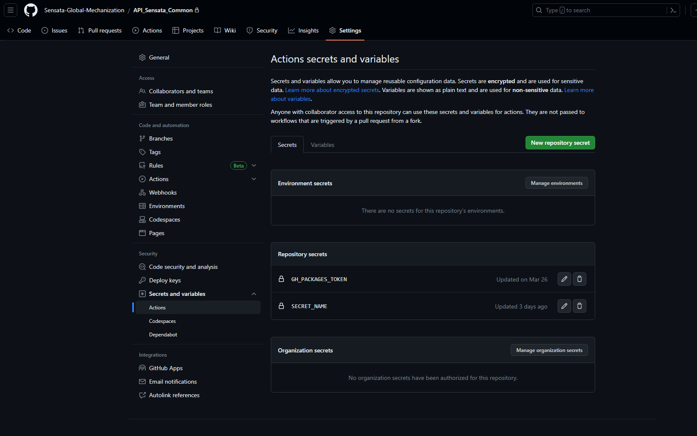

## 7. Action Execution

The Action is executed once a branch is requested to merge into `main`, the corresponding pull request is approved, and the "Merge Pull Request" button is clicked.

## 8. Reviewing Actions and Packages

You can review the actions and packages in the `Actions` and `Packages` tab of the repository, respectively. The images below illustrate this:

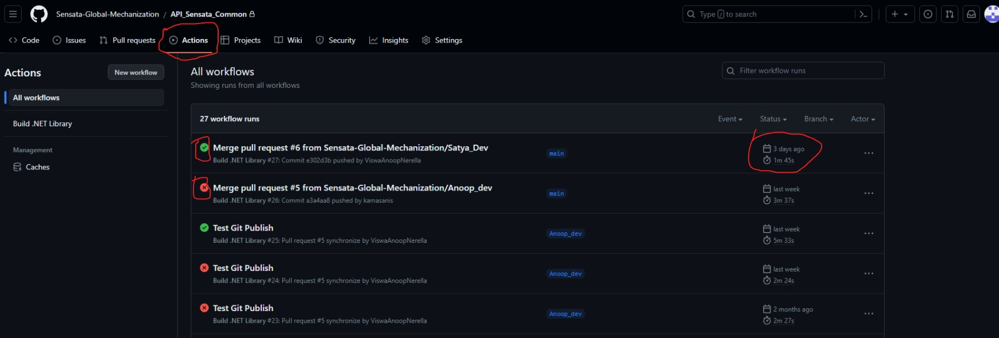

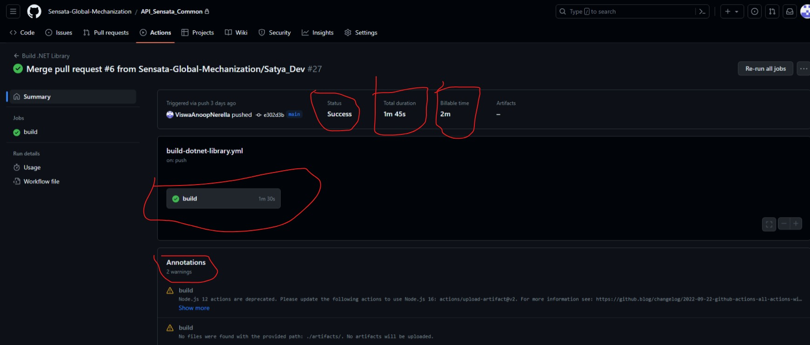

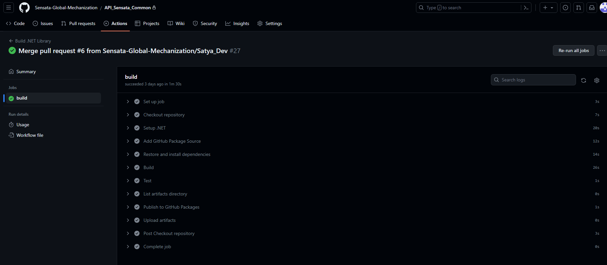

- The below image shows the packages tab in the repository and the corresponding packages published to github packages.

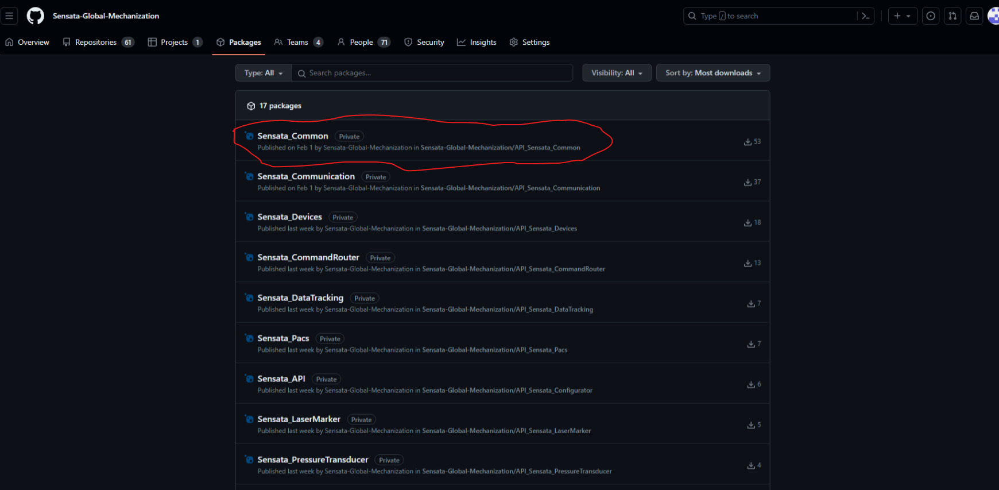

- The below image shows the specific details of the package published to github packages.

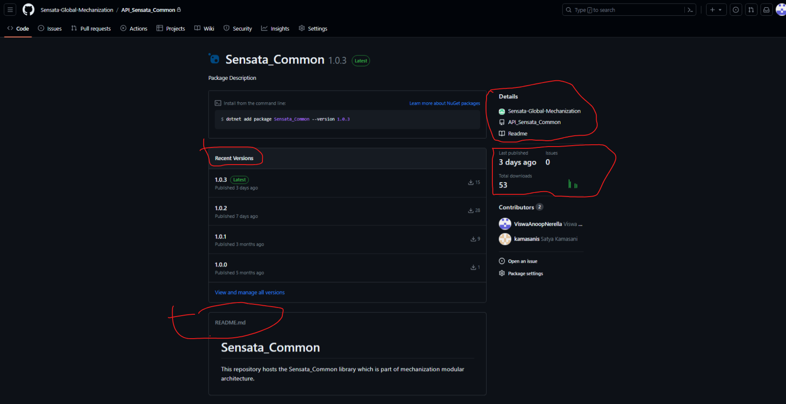

## 9. Running Locally

The current CI scripts run directly on Github Enterprise Cloud. We can also set up a self-hosted runner on a local machine and run the CI scripts on the local machine. This is useful when we want to run the CI scripts on a local machine and publish the packages to a Github Nuget packages server.

## 10. Monitoring Usage

We have a limit of 50000 minutes in Sensata Global Mechanization Github Organization per month. At current levels, we might not reach the limit. But during the first few months, we will keep monitoring and we can set up a self-hosted runner on a local machine and run the CI scripts on the local machine and publish the packages to a Github Nuget packages server if needed.

- Link to monitor the action minutes used for users with admin access - [Sensata Global Mechanization ORG Billing Status](https://github.com/organizations/Sensata-Global-Mechanization/settings/billing)

- Preview Screenshot of the page in the above link - 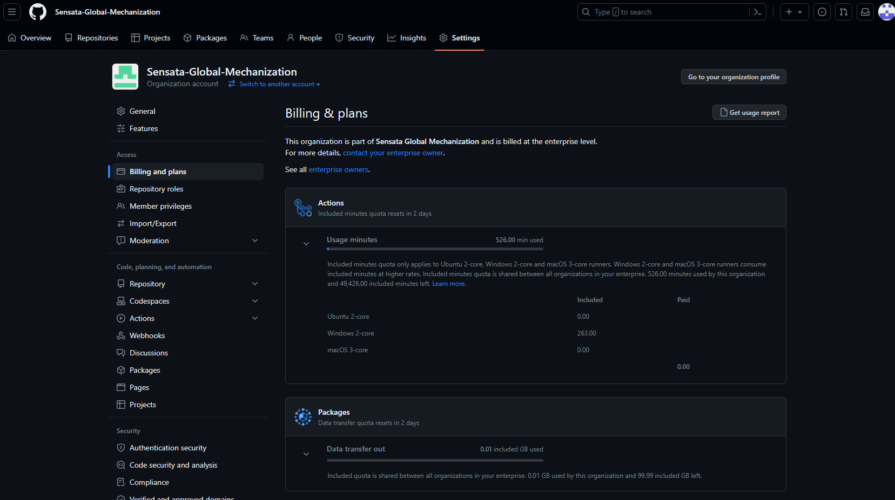

## 11. Further Possibilities

CI scripts can also be used to perform unit testings on our repositories. Team members can explore and come up with suggestions as we progress further.

## 12. Github Package and GitHub Repository Versioning System

`MAJOR.MINOR.PATCH.Pre-release` We will be using the [Semantic Versioning System](https://semver.org/) for versioning our packages. The versioning system is explained in detail in the link provided.

- `Major version` - The major version will be incremented when there is a incompatible API changes.
- `Minor version` - The minor version will be incremented when there is a new functionality in a backward-compatible manner.
- `Patch version` - The patch version will be incremented when there is a backward-compatible bug fixes.
- `Pre-release version` - The pre-release version will be incremented when there is a pre-release version of the package. This is only for testing purposes and will not be used in production.
  - `Link to Read` - [GitHub Prerelease-Packages](https://github.com/NuGet/docs.microsoft.com-nuget/blob/main/docs/create-packages/Prerelease-Packages.md)
  - `alpha` - Alpha version is the first version of the package. This is only for testing purposes and will not be used in production.
  - `beta` - Beta version is the second version of the package. This is only for testing purposes and will not be used in production.
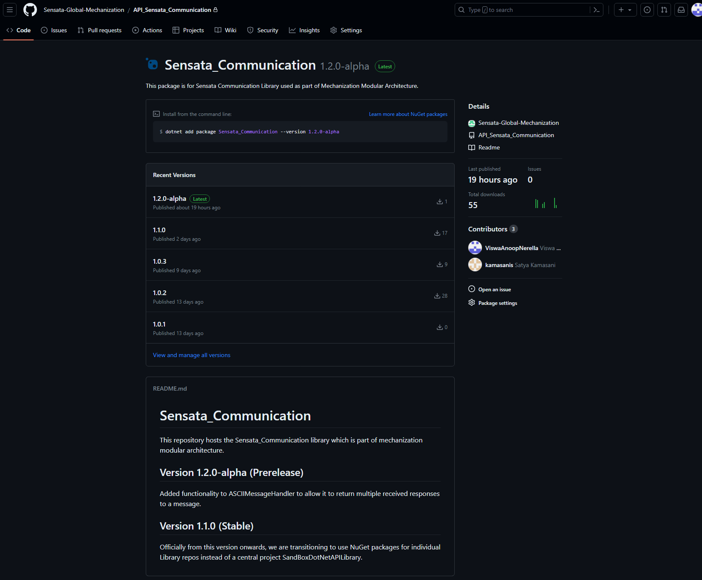
- `Reference Link to Read` - We will be using the [Github Repository Releases](https://docs.github.com/en/repositories/releasing-projects-on-github/about-releases) to tag every release in repository. The link provided explains in detail about the github repository releases.
  - Match the version number of GitHub Releases with the version number of the NuGet package if the repository is associated with a Library.
  - Example GitHub Repo Releases is in below Image.
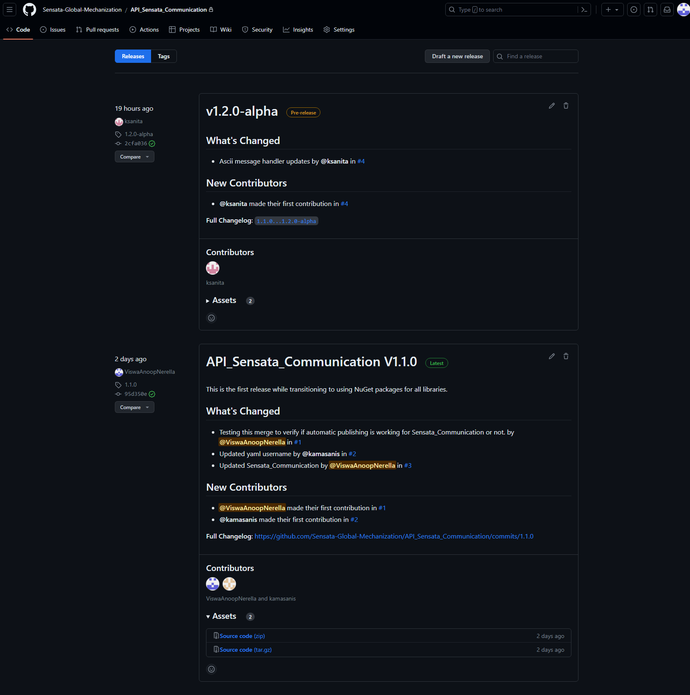

## 13. Where to edit version numbers in the Projects

- Dot Net Core Projects - Edit the `.csproj file` and change the version number in the `<Version>` tag. Example Image shown below.
 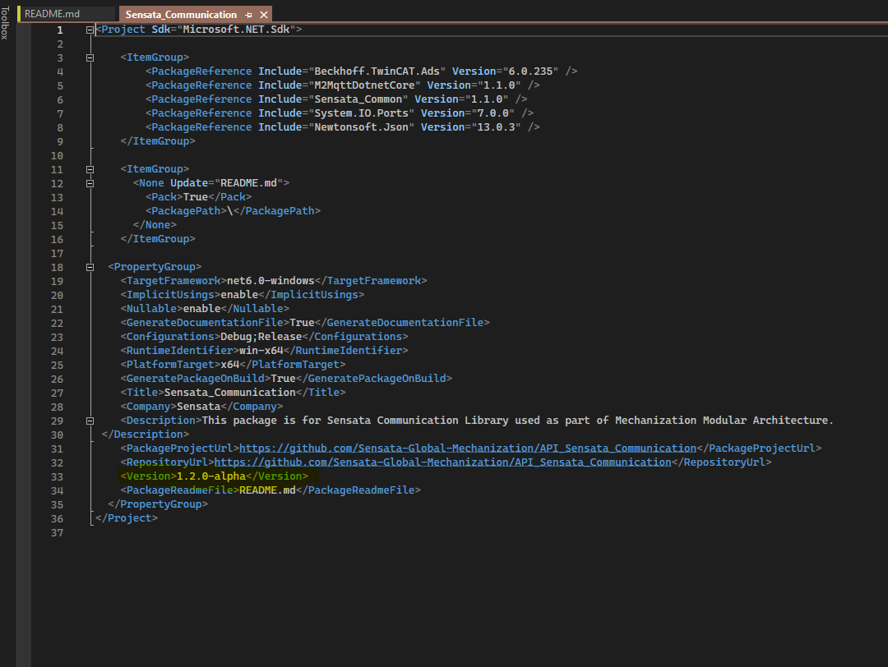
- Dot Net Framework Projects - Edit the `.nuspec file` and change the version number in the `<version>` tag. Example Image shown below.
 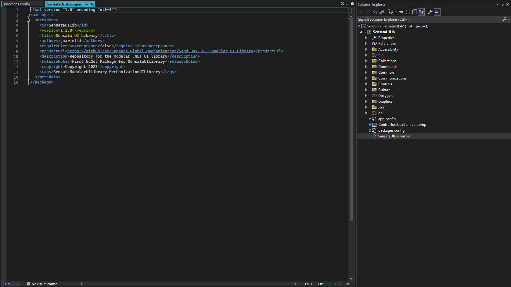

---

# Manually Create and Package NuGet package for Dot Net Core or DotNet Standard projects from Visual Studio and using Package Manager Console

> **This is only for information purpose, Developers should not do anything manually.**

> **Additionally, the NuGet Package Manager will be used to install the packages in a new project**

> **In this Section below, we will use a `nuget.config` file to store configuration values for packaging and publishing .NET Core or .NET Standard NuGet packages to your organization's GitHub Packages.**

Resource -  [Quickstart: Manually Create and publish a package using Visual Studio (.NET Core and Standard, Windows) | Microsoft Learn](https://learn.microsoft.com/en-us/nuget/quickstart/create-and-publish-a-package-using-visual-studio?tabs=netcore-cli)

### Prerequisites

1. Visual Studio 2022 with .NET Core or .NET Standard support.
2. A GitHub account with access to your organization's repositories.
3. A Personal Access Token (PAT) at organization level with `read:packages` and `write:packages` scopes.

### Create a Personal Access Token at the organization level with read:packages and write:packages scopes for Github

1. Go to your GitHub account settings.
2. Select Developer settings.
3. Select Personal access tokens.
4. Click on Generate new token.
5. Give your token a descriptive name.
6. Select the read:packages and write:packages scopes for this token to authorize for your specific tasks.

- A member of a GitHub organization can use a personal access token with the `read:packages` and `write:packages` scopes to publish packages to GitHub Packages within the organization.

7. Set the expiration date for your token to a `SEPCIFIC DATE` rather than `never` if you don’t want it to expire to soon enough.

- setting the expiration date to `never` ensures that the token does not expire, it is generally recommended to set an expiration date for `security reasons`

8. Click on Generate token.

### Create a nuget.config file for your project

1. Open your project or solution in Visual Studio.
2. Select `Tools` > `NuGet Package Manager` > `Package Manager Console` to open the Package Manager Console window.
3. In the console, use the `pwd` command to print the current working directory. For example:

```bash
PM> pwd

Path
----
C:\Users\YourUsername
```

4. Use the `cd` command to navigate to the directory where you want to create the `nuget.config` file. For example, if you want to create the file in the root of your project repository, navigate to that directory:

```bash
PM> cd C:\Path\To\Your\Project\Repository
```

5. Once you are in the desired directory, run the command `dotnet new nugetconfig`. This will create a new `nuget.config` file in the current directory:

```bash
PM> dotnet new nugetconfig
The template "NuGet Config" was created successfully.
```

6. In your .NET Core or .NET Standard project folder, Edit the `nuget.config` with the content in the Sample nuget.config file.–

```xml
<?xml version="1.0" encoding="utf-8"?>
<configuration>
  <packageSources>
    <clear />
    <add key="github" value="https://nuget.pkg.github.com/Sensata-Global-Mechanization/index.json" />
  </packageSources>
  <packageSourceCredentials>
    <github>
      <add key="Username" value="YOUR_GITHUB_USERNAME" />
      <add key="ClearTextPassword" value="ghp_SampleAPIKEY" />
    </github>
  </packageSourceCredentials>
</configuration>
```

7. Replace `Sensata-Global-Mechanization` with another GitHub organization's name, `YOUR_GITHUB_USERNAME` with your GitHub username, and `ghp_SampleAPIKEY` with the Personal Access Token you created earlier.
8. Save and close the `nuget.config` file.

### Configure your project for NuGet packaging

1. Open your .NET Core or .NET Standard project in Visual Studio 2022.
2. Right-click the project in the Solution Explorer and click 'Properties'.
3. In the 'Properties' window, select the 'Package' tab.

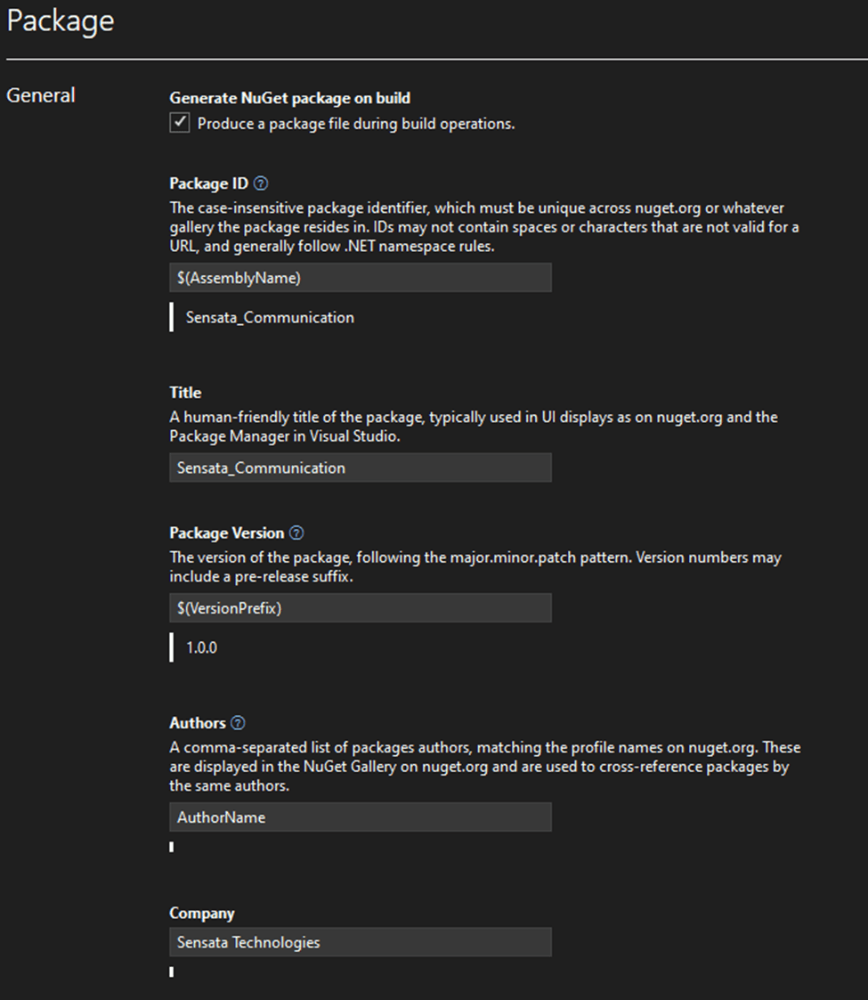

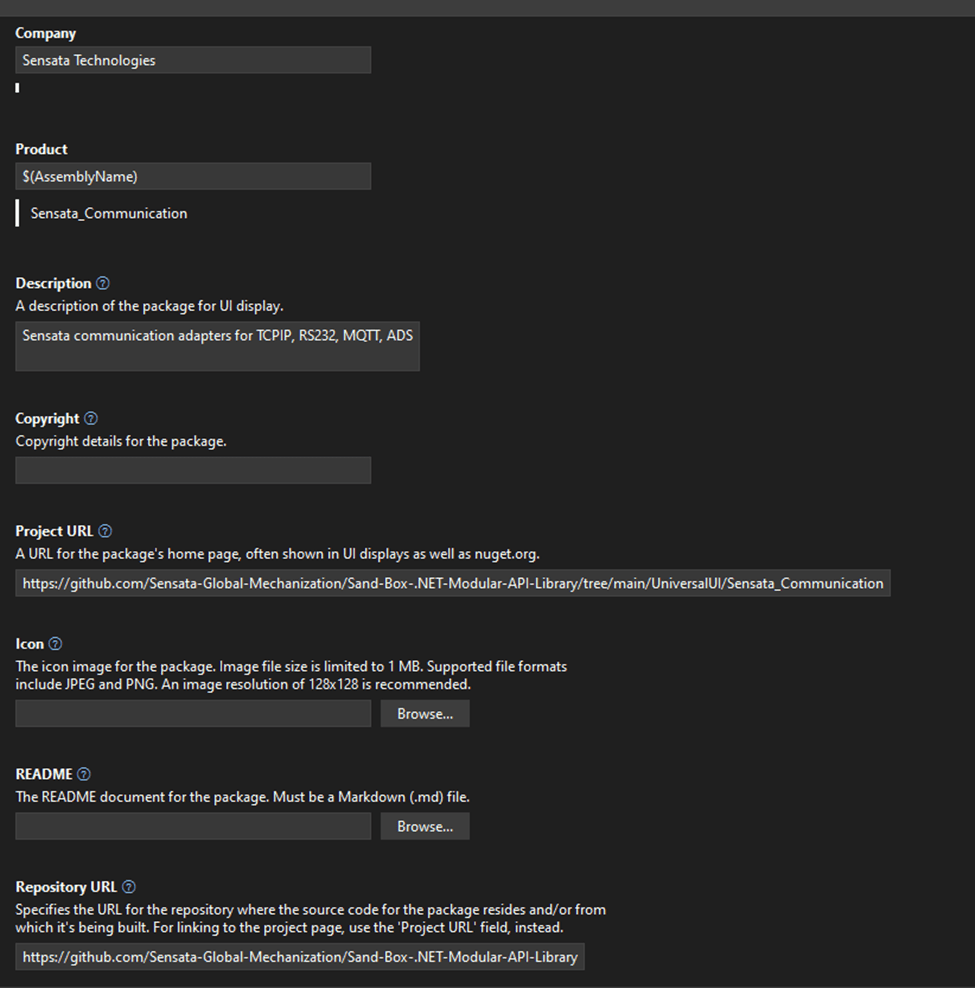

4. Fill in the required fields, such as Package ID, Version, Authors, and Description.

 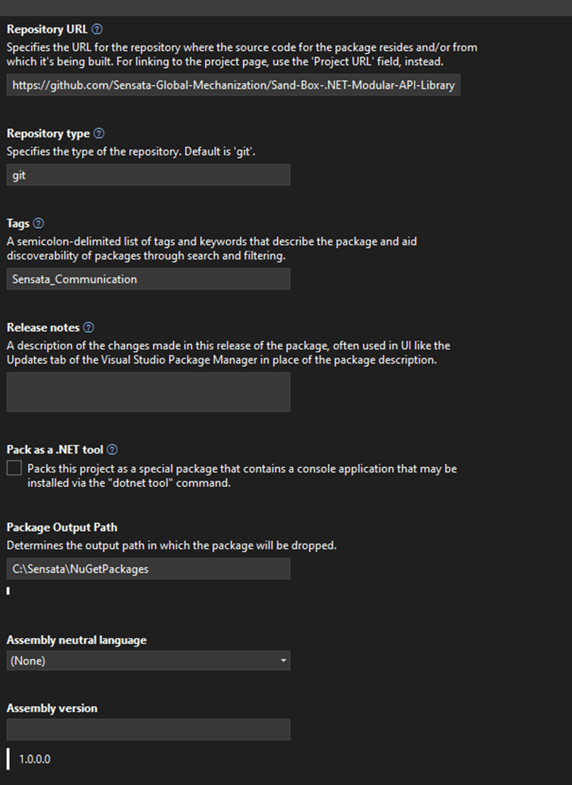

5. Check the 'Generate NuGet package on build' option.
6. Save the changes and close the 'Properties' window.

### Manual Packaging and Publishing of Nuget Packages to GitHub Packages - only for information purpose, Developers need not do anything manually

### Build your project and generate the NuGet package

1. Right-click the project in the Solution Explorer and click 'Rebuild'. This will build your project and generate a NuGet package in the output folder (usually in the "bin\Release" or "bin\Debug" folder).
2. Locate the generated .nupkg file in the output folder.

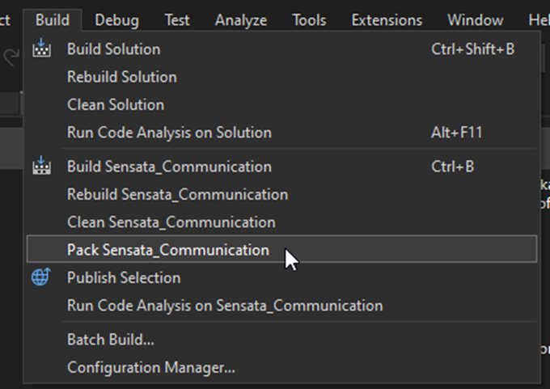

### Publish your NuGet package to GitHub Packages using Package Manager Console

1. In Visual Studio 2022, open the Package Manager Console by clicking 'View' > 'Other Windows' > 'Package Manager Console'.
2. In the Package Manager Console, navigate to the folder containing the .nupkg file by running the command:

```bash
cd "path\to\your\output\folder"
```

2. Run the following command to publish the NuGet package to GitHub Packages:

```bash
nuget push -Source "GitHub" -ApiKey az YOUR_PACKAGE.nupkg
```

3. Replace `YOUR_PACKAGE.nupkg` with the filename of the .nupkg file generated earlier.
4. The NuGet package should now be published to your organization's GitHub Packages. You can verify this by visiting the 'Packages' tab in your GitHub organization's profile.

### Use NuGet Package Manager to install packages from GitHub Packages in a new project

1. Open the new project in Visual Studio 2022 that needs to consume the published NuGet package.
2. Right-click on the project in the Solution Explorer and click 'Add' > 'New Item'.
3. In the 'Add New Item' dialog, search for 'NuGet' and select 'NuGet Configuration File'.
4. Click 'Add' to create a new `nuget.config` file.
5. Open the `nuget.config` file and add the following content:

```xml
xml
<?xml version="1.0" encoding="utf-8"?>
<configuration>
<packageSources>
<add key="GitHub" value="https://nuget.pkg.github.com/ORGANIZATION_NAME/index.json" />
</packageSources>
<packageSourceCredentials>
<GitHub>
<add key="Username" value="YOUR_GITHUB_USERNAME" />
<add key="ClearTextPassword" value="YOUR_PERSONAL_ACCESS_TOKEN" />
</GitHub>
</packageSourceCredentials>
</configuration>
```

- Replace `ORGANIZATION_NAME` with your GitHub organization's name, `YOUR_GITHUB_USERNAME` with your GitHub username, and `YOUR_PERSONAL_ACCESS_TOKEN` with the Personal Access Token you created earlier.

6. Save and close the `nuget.config` file.
7. In Visual Studio, right-click on the project in the Solution Explorer and click 'Manage NuGet Packages'.

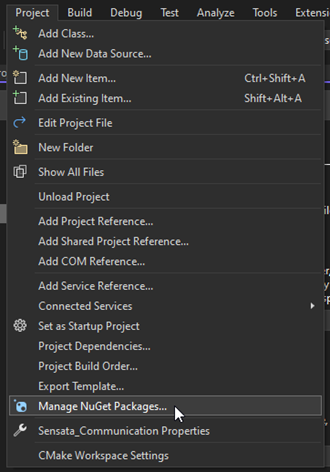

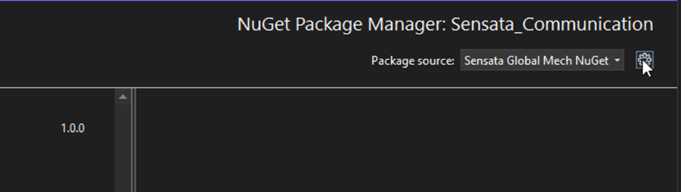

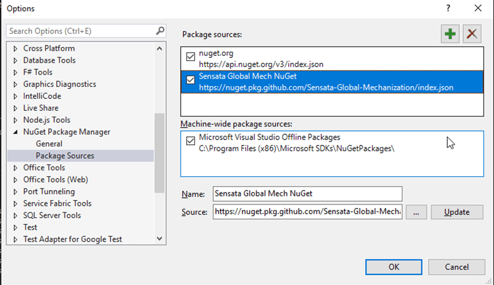

8. In the 'NuGet Package Manager' window, click on the 'Settings' (gear) icon in the top right corner.
9. In the 'Options' window, under 'NuGet Package Manager' > 'Package Sources', make sure the GitHub source is added and enabled. If it's not, add a new package source with the name 'GitHub' and the source URL `https://nuget.pkg.github.com/ORGANIZATION_NAME/index.json`, then click 'Update' and 'OK'.
10. Back in the 'NuGet Package Manager' window, select the 'GitHub' package source from the drop-down menu.
11. Search for your package using the Package ID you specified when publishing.
12. Select your package from the search results and click 'Install' to add it to your project.

## Dot Net Framework Projects Instructions - Manually Package and Publish NuGet Packages for .NET Framework Projects

### Below is step-by-step instructions for creating, packaging, and publishing NuGet packages for .NET Framework projects using the Package Manager Console in Visual Studio

Resource -  [Quickstart: Create and publish a package using Visual Studio (.NET Framework, Windows) | Microsoft Learn](https://learn.microsoft.com/en-us/nuget/quickstart/create-and-publish-a-package-using-visual-studio-net-framework)

### Prerequisites

1. Visual Studio with .NET Framework support.
2. NuGet CLI installed. You can download it from [here](https://www.nuget.org/downloads).
3. A GitHub account with access to your organization's repositories.
4. A Personal Access Token (PAT) with `read:packages` and `write:packages` scopes.

- [Creating a personal access token - GitHub Docs](https://docs.github.com/en/authentication/keeping-your-account-and-data-secure/creating-a-personal-access-token)

### Create a NuGet Specification file

1. Open the Package Manager Console in Visual Studio by clicking 'View' > 'Other Windows' > 'Package Manager Console'.
2. In the Package Manager Console, run the following command:

```bash
nuget spec
```

- This command creates a `.nuspec` file in your project folder.

```xml
<?xml version="1.0" encoding="utf-8"?>
<package >
  <metadata>
    <id>SensataUILib</id>
    <version>1.0.0</version>
    <title>SensataUILib</title>
    <authors>jmarioiii</authors>
    <requireLicenseAcceptance>false</requireLicenseAcceptance>
    <license type="expression">MIT</license>
    <!-- <icon>icon.png</icon> -->
    <projectUrl>https://github.com/Sensata-Global-Mechanization/Sand-Box-.NET-Modular-UI-Library</projectUrl>
    <description>Repository for the modular .NET UI library</description>
    <releaseNotes>First NuGet Package for SensataUILibrary</releaseNotes>
    <copyright>Copyright 2023</copyright>
    <tags>SensataModularUILibrary MechanizationUILibrary</tags>
  </metadata>
</package>
```

### Edit the .nuspec file

1. Open the generated `.nuspec` file in Visual Studio or any text editor.
2. Edit the file according to your package requirements. Here is a sample `.nuspec` file:

```xml
<?xml version="1.0"?>
<package>
<metadata>
<id>MyPackageId</id>
<version>1.0.0</version>
<title>My Package Title</title>
<authors>Your Name</authors>
<owners>Your Name</owners>
<requireLicenseAcceptance>false</requireLicenseAcceptance>
<description>A brief description of your package.</description>
<releaseNotes>Summary of changes made in this release of the package.</releaseNotes>
<copyright>Copyright 2022 Your Name</copyright>
<tags>tag1 tag2 tag3</tags>
</metadata>
</package>
```

 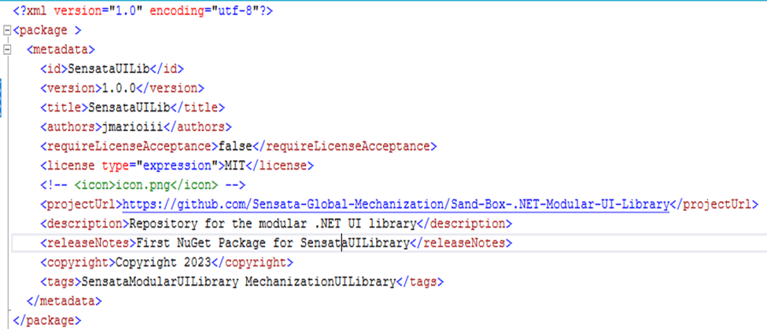

- Replace the placeholder values with your package's specific details.

3. Save and close the `.nuspec` file.

### Package the NuGet package

1. In the Package Manager Console, navigate to the folder containing the `.nuspec` file by running the command:

```bash
cd "path\to\your\project\folder"
```

2. Run the following command to create the NuGet package based on the `.nuspec` file:

```bash
nuget pack YourPackageName.nuspec
```

- Replace `YourPackageName.nuspec` with the name of your `.nuspec` file. This command creates a `.nupkg` file in the project folder.

### Publish the NuGet package to GitHub Packages

1. In the Package Manager Console, run the following command to publish the NuGet package to your organization's GitHub Packages:

```bash
dotnet nuget push SensataUILib.1.0.0.nupkg -k YOUR_PERSONAL_ACCESS_TOKEN -s https://nuget.pkg.github.com/Sensata-Global-Mechanization/index.json
```

- Replace `SensataUILib.1.0.0.nupkg` with the name of your `.nupkg` file, `YOUR_PERSONAL_ACCESS_TOKEN` with the Personal Access Token you created earlier

2. The NuGet package should have now been published to your organization's GitHub Packages.
